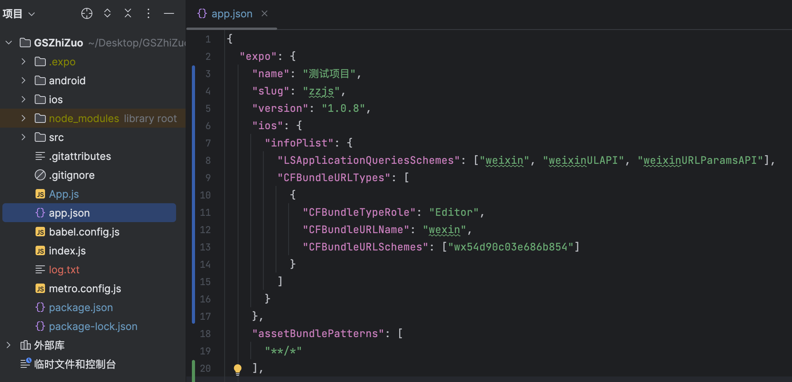
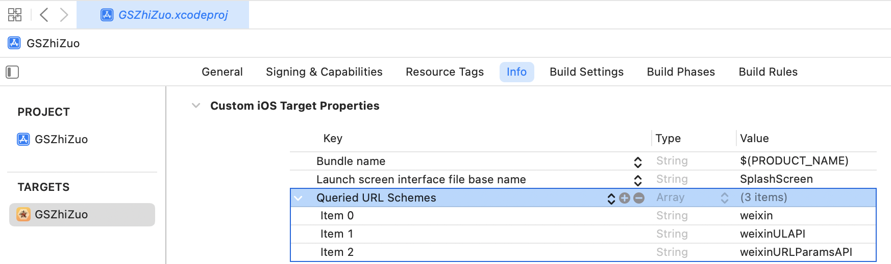

# expo-react-native-wechat

本库为 expo react native 项目提供 Wechat SDK 支持, 集成了微信SDK:
- Android SDK 6.8.23 +
- iOS SDK 2.0.2 +

## 安装
`$ npx expo install expo-react-native-wechat`

或

`$ yarn add expo-react-native-wechat`

或

`$ npm install expo-react-native-wechat --save`


## 设置iOS Universal Links

1、苹果开发者后台开启Associated Domains，查看项目TeamID

https://developer.apple.com/account/resources/identifiers/list


2、创建文件【apple-app-site-association】（这一步需要后台人员配合）
```
{
   "applinks": {
       "apps": [],
       "details": [
           {
               "appID": "8P7343TG54.com.tencent.xin.SDKSample",
               "paths": [ "/test/*" ]
           }
       ]
   }
}
```
将上面的JSON保存为【apple-app-site-association】文件放到网站【.well-known】目录 或者 网站根目录中

注意事项：

（1）apple-app-site-association文件没有后缀名，appID前面部分是在开发者后台查看的TeamID, 后面部分是iOS项目的bundleId

（2）把【apple-app-site-association】文件放到网站【.well-known】目录 或者 网站根目录中

（3）域名必须支持https，保证下面路径可以访问: https://help.wechat.com/.well-known/apple-app-site-association 或 https://help.wechat.com/apple-app-site-association

（4）验证方式,通过下面链接可以查看我们设置的文件内容就说明成功了：https://app-site-association.cdn-apple.com/a/v1/help.wechat.com  ， 因苹果Universal Links更新机制，文件放好后不会立即生效，如果验证不过，可以过两天再试。

3、在Xcode中设置Associated Domains域名（放apple-app-site-association文件的域名）

在XCode中的 `Targets` > `Signing & Capabilitles` > `Associated Domains` > 添加【applinks:www.baidu.com】


## 在expo中一键配置
1、在项目根目录的【app.json】中添加如下配置
```
{
    "expo":{
    ....
        "ios": {
          "infoPlist": {
            "LSApplicationQueriesSchemes": ["weixin", "weixinULAPI", "weixinURLParamsAPI"],
            "CFBundleURLTypes": [
              {
                "CFBundleTypeRole": "Editor",
                "CFBundleURLName": "wexin",
                "CFBundleURLSchemes": ["wx54d90c03e686b854"]
              }
            ]
          }
        },
    ....
    }
}
```



2、执行命令

`$ npx expo prebuild`


## 在react native中手动配置
### RN ios配置
1、在XCode中的 `Targets` > `info` > `URL type` > `URL Schema` 添加微信的AppID


或者在Info.plist文件中添加：
```xml
<key>CFBundleURLTypes</key>
<array>
    <dict>
        <key>CFBundleTypeRole</key>
        <string>Editor</string>
        <key>CFBundleURLName</key>
        <string>wexin</string>
        <key>CFBundleURLSchemes</key>
        <array>
            <string>wx54d90c03e686b854</string>
        </array>
    </dict>
</array>
```
2、在XCode中的 `Targets` > `info` > `Custom iOS Target Properties` 
添加 `Queried URL Schemes` 下面添加 `weixin`、`weixinULAPI`、`weixinURLParamsAPI`



或者在Info.plist文件中添加：
```xml
<key>LSApplicationQueriesSchemes</key>
<array>
    <string>weixin</string>
    <string>weixinULAPI</string>
    <string>weixinURLParamsAPI</string>
</array>
```

### RN android配置
android无需额外配置。


## 调用库
```javascript
import { StatusBar } from 'expo-status-bar';
import React from 'react';
import { StyleSheet, Text, View } from 'react-native';
import * as WeChat from 'expo-react-native-wechat';

export default function App() {
    return (
        <View style={styles.container}>
            <Text onPress={()=>{
                WeChat.registerApp('wx54d90c03e686b854', 'https://www.baidu.com/').then((a)=>{
                    console.log("==registerApp==>",a);
                });
            }}>registerApp</Text>
            <Text onPress={()=>{
                WeChat.isWXAppInstalled().then((a)=>{
                    console.log("==isWXAppInstalled==>",a);
                });
            }}>isWXAppInstalled</Text>
            <Text onPress={()=>{
                WeChat.getApiVersion().then((a)=>{
                    console.log("==getApiVersion==>",a);
                });
            }}>getApiVersion</Text>
            <Text onPress={()=>{
                WeChat.openWXApp().then((a)=>{
                    console.log("==openWXApp==>",a);
                });
            }}>openWXApp</Text>
            <Text onPress={()=>{
                WeChat.shareText({
                    text: 'Text content.',
                    scene: 0,
                }).then((a)=>{
                    console.log("==shareText==>",a);
                });
            }}>shareText</Text>
            <StatusBar style="auto" />
        </View>
    );
}

const styles = StyleSheet.create({
    container: {
        flex: 1,
        backgroundColor: '#fff',
        alignItems: 'center',
        justifyContent: 'center',
    },
});

```


## API 文档

本库支持 `TypeScript`，使用 `Promise` 或 `async/await` 来接收返回。

接口名称和参数尽量跟腾讯官网保持一致性，除了嵌套对象变成扁平对象，你可以直接查看腾讯文档来获得更多帮助。

#### registerApp(appid) 注册

- `appid` {String} the appid you get from WeChat dashboard
- returns {Boolean} explains if your application is registered done

This method should be called once globally.

```js
import * as WeChat from 'expo-react-native-wechat';

WeChat.registerApp('appid', 'universalLink');
```

#### isWXAppInstalled() 判断微信是否已安装

- returns {Boolean} if WeChat is installed.

Check if the WeChat app is installed on the device.

#### isWXAppSupportApi() 检查支持情况

- returns {Boolean} Contains the result.

Check if wechat support open url.

#### getApiVersion() 获取 API 版本号

- returns {String} Contains the result.

Get the WeChat SDK api version.

#### openWXApp() 打开微信

- returns {Boolean}

Open the WeChat app from your application.

#### sendAuthRequest([scope[, state]]) 微信授权登录

- `scope` {Array|String} Scopes of auth request.
- `state` {String} the state of OAuth2
- returns {Object}

Send authentication request, and it returns an object with the
following fields:

| field   | type   | description                         |
| ------- | ------ | ----------------------------------- |
| errCode | Number | Error Code                          |
| errStr  | String | Error message if any error occurred |
| openId  | String |                                     |
| code    | String | Authorization code                  |
| url     | String | The URL string                      |
| lang    | String | The user language                   |
| country | String | The user country                    |

#### ShareText(ShareTextMetadata) 分享文本

ShareTextMetadata

| name  | type   | description                    |
| ----- | ------ | ------------------------------ |
| text  | String | 分享文本                       |
| scene | Number | 分享到, 0:会话 1:朋友圈 2:收藏 |

Return:

| name    | type   | description                         |
| ------- | ------ | ----------------------------------- |
| errCode | Number | 0 if authorization succeed          |
| errStr  | String | Error message if any error occurred |

```js
import * as WeChat from 'expo-react-native-wechat';

WeChat.shareText({
  text: 'Text content.',
  scene: 0,
});
```

#### ShareImage(ShareImageMetadata) 分享图片

ShareImageMetadata

| name     | type   | description                    |
| -------- | ------ | ------------------------------ |
| imageUrl | String | 图片地址                       |
| scene    | Number | 分享到, 0:会话 1:朋友圈 2:收藏 |

Return:

| name    | type   | description                         |
| ------- | ------ | ----------------------------------- |
| errCode | Number | 0 if authorization succeed          |
| errStr  | String | Error message if any error occurred |

```js
import * as WeChat from 'expo-react-native-wechat';

WeChat.shareImage({
  imageUrl: 'https://google.com/1.jpg',
  scene: 0,
});
```

#### ShareLocalImage(ShareImageMetadata) 分享本地图片

ShareImageMetadata

| name     | type   | description                    |
| -------- | ------ | ------------------------------ |
| imageUrl | String | 图片地址                       |
| scene    | Number | 分享到, 0:会话 1:朋友圈 2:收藏 |

Return:

| name    | type   | description                         |
| ------- | ------ | ----------------------------------- |
| errCode | Number | 0 if authorization succeed          |
| errStr  | String | Error message if any error occurred |

#### ShareFile(ShareFileMetadata) 分享文件

ShareFileMetadata

| name  | type   | description    |
| ----- | ------ | -------------- |
| url   | String | 文件地址       |
| title | String | 文件标题       |
| scene | Number | 分享到, 0:会话 |

Return:

| name    | type   | description                         |
| ------- | ------ | ----------------------------------- |
| errCode | Number | 0 if authorization succeed          |
| errStr  | String | Error message if any error occurred |

```js
import * as WeChat from 'expo-react-native-wechat';

WeChat.shareFile({
  imageUrl: 'https://sdcard/test.png',
  title: '测试文件.pdf',
  scene: 0,
});
```

#### ShareMusic(ShareMusicMetadata) 分享音乐

ShareMusicMetadata

| name                | type   | description                           |
| ------------------- | ------ | ------------------------------------- |
| title               | String | 标题                                  |
| description         | String | 描述                                  |
| thumbImageUrl       | String | 缩略图地址，本库会自动压缩到 32KB     |
| musicUrl            | String | 音频网页的 URL 地址                   |
| musicLowBandUrl     | String | 供低带宽环境下使用的音频网页 URL 地址 |
| musicDataUrl        | String | 音频数据的 URL 地址                   |
| musicLowBandDataUrl | String | 供低带宽环境下使用的音频数据 URL 地址 |
| scene               | Number | 分享到, 0:会话 1:朋友圈 2:收藏        |

Return:

| name    | type   | description                         |
| ------- | ------ | ----------------------------------- |
| errCode | Number | 0 if authorization succeed          |
| errStr  | String | Error message if any error occurred |

```js
import * as WeChat from 'expo-react-native-wechat';

WeChat.shareMusic({
  title: 'Good music.',
  musicUrl: 'https://google.com/music.mp3',
  thumbImageUrl: 'https://google.com/1.jpg',
  scene: 0,
});
```

#### ShareVideo(ShareVideoMetadata) 分享视频

ShareVideoMetadata

| name            | type   | description                       |
| --------------- | ------ | --------------------------------- |
| title           | String | 标题                              |
| description     | String | 描述                              |
| thumbImageUrl   | String | 缩略图地址，本库会自动压缩到 32KB |
| videoUrl        | String | 视频链接                          |
| videoLowBandUrl | String | 供低带宽的环境下使用的视频链接    |
| scene           | Number | 分享到, 0:会话 1:朋友圈 2:收藏    |

Return:

| name    | type   | description                         |
| ------- | ------ | ----------------------------------- |
| errCode | Number | 0 if authorization succeed          |
| errStr  | String | Error message if any error occurred |

```js
import * as WeChat from 'expo-react-native-wechat';

WeChat.shareVideo({
  title: 'Interesting video.',
  videoUrl: 'https://google.com/music.mp3',
  thumbImageUrl: 'https://google.com/1.jpg',
  scene: 0,
});
```

#### ShareWebpage (ShareWebpageMetadata) 分享网页

ShareWebpageMetadata

| name          | type   | description                       |
| ------------- | ------ | --------------------------------- |
| title         | String | 标题                              |
| description   | String | 描述                              |
| thumbImageUrl | String | 缩略图地址，本库会自动压缩到 32KB |
| webpageUrl    | String | HTML 链接                         |
| scene         | Number | 分享到, 0:会话 1:朋友圈 2:收藏    |

Return:

| name    | type   | description                         |
| ------- | ------ | ----------------------------------- |
| errCode | Number | 0 if authorization succeed          |
| errStr  | String | Error message if any error occurred |

```js
import * as WeChat from 'expo-react-native-wechat';

WeChat.shareWebpage({
  title: 'Interesting web.',
  videoUrl: 'https://google.com/music.mp3',
  thumbImageUrl: 'https://google.com/1.jpg',
  scene: 0,
});
```

#### ShareMiniProgram(ShareMiniProgramMetadata) 分享小程序

ShareMiniProgram

| name            | type   | description                                                                        |
| --------------- | ------ | ---------------------------------------------------------------------------------- |
| title           | String | 标题                                                                               |
| description     | String | 描述                                                                               |
| thumbImageUrl   | String | 缩略图地址，本库会自动压缩到 32KB                                                  |
| userName        | String | 小程序的 userName，填小程序原始 id                                                 |
| path            | String | 小程序的页面路径                                                                   |
| hdImageUrl      | String | 小程序新版本的预览图二进制数据，6.5.9 及以上版本微信客户端支持                     |
| withShareTicket | String | 是否使用带 shareTicket 的分享                                                      |
| miniProgramType | Number | 小程序的类型，默认正式版，1.8.1 及以上版本开发者工具包支持分享开发版和体验版小程序 |
| webpageUrl      | String | 兼容低版本的网页链接                                                               |
| scene           | Number | 分享到, 0:会话 1:朋友圈 2:收藏                                                     |

Return:

| name    | type   | description                         |
| ------- | ------ | ----------------------------------- |
| errCode | Number | 0 if authorization succeed          |
| errStr  | String | Error message if any error occurred |

```js
import * as WeChat from 'expo-react-native-wechat';

WeChat.shareMiniProgram({
  title: 'Mini program.',
  userName: 'gh_d39d10000000',
  webpageUrl: 'https://google.com/show.html',
  thumbImageUrl: 'https://google.com/1.jpg',
  scene: 0,
});
```

#### LaunchMiniProgram (LaunchMiniProgramMetadata) 跳到小程序

LaunchMiniProgramMetadata

| name            | type   | description                                                                                                                |
| --------------- | ------ | -------------------------------------------------------------------------------------------------------------------------- |
| userName        | String | 填小程序原始 id                                                                                                            |
| miniProgramType | Number | 可选打开 开发版，体验版和正式版                                                                                            |
| path            | String | 拉起小程序页面的可带参路径，不填默认拉起小程序首页，对于小游戏，可以只传入 query 部分，来实现传参效果，如：传入 "?foo=bar" |

Return:

| name    | type   | description                         |
| ------- | ------ | ----------------------------------- |
| errCode | Number | 0 if authorization succeed          |
| errStr  | String | Error message if any error occurred |

```js
import * as WeChat from 'expo-react-native-wechat';

WeChat.launchMiniProgram({
  userName: 'gh_d39d10000000',
  miniProgramType: 1,
});
```

#### ChooseInvoice (ChooseInvoice) 选择发票

ChooseInvoice

| name      | type   | description |
| --------- | ------ | ----------- |
| cardSign  | String | 签名        |
| signType  | String | 签名类型    |
| timeStamp | Number | 当前时间戳  |
| nonceStr  | String | 随机字符串  |

Invoice

| name        | type   | description |
| ----------- | ------ | ----------- |
| appId       | String |             |
| cardId      | String | 发票 Id     |
| encryptCode | String | 加密串      |

Return:

| name    | type      | description                         |
| ------- | --------- | ----------------------------------- |
| errCode | Number    | 0 if authorization succeed          |
| cards   | Invoice[] | 发票数据                            |
| errStr  | String    | Error message if any error occurred |

```js
import * as WeChat from 'expo-react-native-wechat';

// ios 什么都不填都可以，android可以填写以下假的内容都可以正常运行，具体参数获取可以去看微信文档
WeChat.chooseInvoice({
  cardSign: 'cardSign',
  signType: 'SHA256',
  timeStamp: Date.now(),
  nonceStr: `${Date.now()}`,
});
```

#### pay(payload) 支付

- `payload` {Object} the payment data
    - `partnerId` {String} 商家向财付通申请的商家 ID
    - `prepayId` {String} 预支付订单 ID
    - `nonceStr` {String} 随机串
    - `timeStamp` {String} 时间戳
    - `package` {String} 商家根据财付通文档填写的数据和签名
    - `sign` {String} 商家根据微信开放平台文档对数据做的签名
- returns {Object}

Sends request for proceeding payment, then returns an object:

| name    | type   | description                         |
| ------- | ------ | ----------------------------------- |
| errCode | Number | 0 if authorization succeed          |
| errStr  | String | Error message if any error occurred |

#### subscribeMessage(SubscribeMessageMetadata) 一次性订阅消息

- returns {Object}

| name       | type   | description                                                                                                                                                                                                                           |
| ---------- | ------ | ------------------------------------------------------------------------------------------------------------------------------------------------------------------------------------------------------------------------------------- |
| scene      | Number | 重定向后会带上 scene 参数，开发者可以填 0-10000 的整形值，用来标识订阅场值                                                                                                                                                            |
| templateId | String | 订阅消息模板 ID，在微信开放平台提交应用审核通过后获得                                                                                                                                                                                 |
| reserved   | String | 用于保持请求和回调的状态，授权请后原样带回给第三方。该参数可用于防止 csrf 攻击（跨站请求伪造攻击），建议第三方带上该参数，可设置为简单的随机数加 session 进行校验，开发者可以填写 a-zA-Z0-9 的参数值，最多 128 字节，要求做 urlencode |

#### 回调事件订阅

从小程序回到 APP，或者支付成功回到 APP 都会触发回调事件来返回相应信息，请在触发相应方法前提前添加事件队列。

```
    WeChat.registerApp(Global.APP_ID, Global.UNIVERSAL_LINK);
    DeviceEventEmitter.addListener('WeChat_Req', req => {
      console.log('req:', req)
      if (req.type === 'LaunchFromWX.Req') { // 从小程序回到APP的事件
        miniProgramCallback(req.extMsg)
      }
    });
    DeviceEventEmitter.addListener('WeChat_Resp', resp => {
      console.log('res:', resp)
      if (resp.type === 'WXLaunchMiniProgramReq.Resp') { // 从小程序回到APP的事件
        miniProgramCallback(resp.extMsg)
      } else if (resp.type === 'SendMessageToWX.Resp') { // 发送微信消息后的事件
        sendMessageCallback(resp.country)
      } else if (resp.type === 'PayReq.Resp') { // 支付回调
        payCallback(resp)
      }
    });
```
